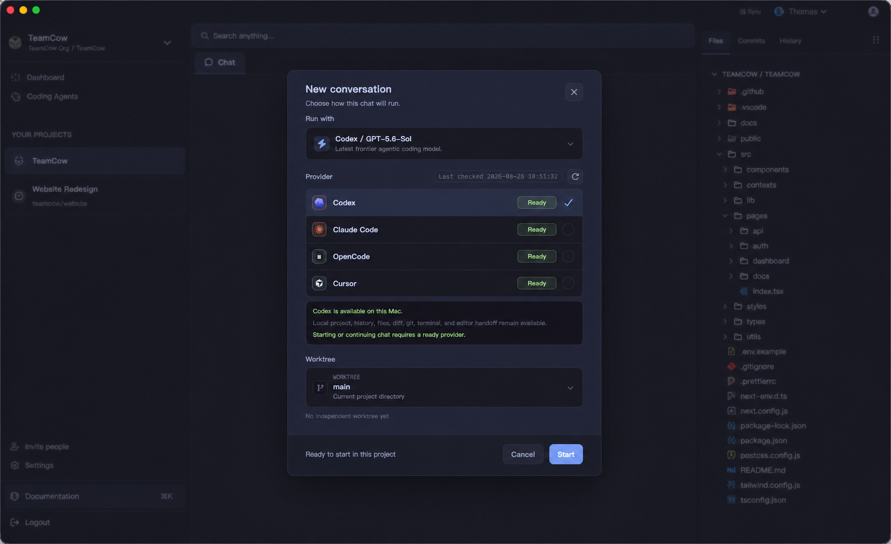

<p align="center">
  
</p>

<h1 align="center">TeamCow</h1>

<p align="center">
  A local-first, chat-first AI coding workspace for macOS.
</p>

<p align="center">
  <a href="README.md">中文</a> · English
</p>

> [!IMPORTANT]
> TeamCow is currently an early `0.0.0` project intended for source builds and developer evaluation on macOS. Review the security notes and release status below before using it on important projects.



## What is TeamCow?

TeamCow connects AI coding agents already installed on your Mac to one desktop workspace. It does not reimplement the agents or take ownership of their accounts and authentication. You keep using each provider's native CLI; TeamCow organizes projects, conversations, execution targets, live activity, and result review.

The product model is `Project -> Conversation`. A project can contain multiple conversations, and each conversation is bound to one provider, model, and working directory or Git worktree for isolated execution and side-by-side comparison.

## Highlights

- Use Codex, Claude Code, OpenCode, and Cursor Agent from one interface.
- Bind each conversation to the project directory, an existing worktree, or a new worktree.
- Review normalized output, tool activity, and run status in the chat timeline.
- Inspect or take over local work through Files, Changes, Git, and Terminal.
- Persist projects, conversations, run events, and artifacts in local SQLite storage.
- Switch between English and Chinese interfaces, light/dark themes, and macOS notifications.

## How it fits together

```text
Project
└── Conversation
    ├── Provider + Model
    ├── Access mode
    ├── Working directory / Git worktree
    ├── Chat timeline
    └── Inspector (Files / Changes / Git / Terminal)
```

TeamCow uses the provider's native status as the source of truth for readiness. Install and authenticate at least one supported CLI before launching TeamCow:

| Provider | Local command | Official documentation |
| --- | --- | --- |
| Codex | `codex` | [openai/codex](https://github.com/openai/codex) |
| Claude Code | `claude` | [Claude Code docs](https://docs.anthropic.com/en/docs/claude-code/getting-started) |
| OpenCode | `opencode` | [OpenCode docs](https://opencode.ai/docs) |
| Cursor Agent | `cursor-agent` | [Cursor CLI docs](https://cursor.com/docs/cli/overview) |

## Local development

### Requirements

- macOS (the primary V1 platform)
- Node.js `22.22.2` (`.node-version` and `.nvmrc`)
- Yarn `1.22.22` (pinned by the root `packageManager` field)
- Git
- Xcode Command Line Tools for Electron native modules
- At least one installed and natively authenticated provider CLI

### Start the app

```bash
corepack enable
yarn install --frozen-lockfile
yarn dev
```

The first launch, or a Node/Electron version change, may take longer while native modules are rebuilt. If Electron starts like a regular Node process, see [desktop development troubleshooting](docs/desktop-dev-troubleshooting.md).

### Verify a change

```bash
yarn typecheck
yarn lint
yarn test
yarn i18n:check
yarn build
yarn workspace @teamcow/desktop smoke
```

### Build a macOS package

```bash
yarn workspace @teamcow/desktop package:mac
```

Artifacts are written to `apps/desktop/release/`. Local builds are unsigned and unnotarized by default, and the update feed is still a placeholder. Do not distribute them as production releases without completing signing, notarization, update-feed configuration, and the [macOS V1 release checklist](docs/macos-v1-release-checklist.md).

## Repository layout

```text
apps/desktop/                 Electron + React desktop application
packages/db/                  SQLite / Drizzle schema and migrations
packages/shared-types/        Cross-process types and Zod contracts
packages/i18n-resources/      English and Chinese resources
scripts/                      Repository checks and release scripts
docs/                         Architecture, troubleshooting, release, and design records
app-screenshots/              Sanitized screenshots used by public documentation
```

File icons are generated from the pinned `material-icon-theme` dependency before `yarn dev` and `yarn build`, keeping more than 1,000 derived SVGs out of source control. See the [architecture overview](docs/architecture.md) for the runtime boundaries.

## Local data and security

- TeamCow stores `teamcow.sqlite`, conversation attachments, and application logs under Electron's `userData` directory. These files are not part of the repository.
- TeamCow invokes provider tools installed on your machine and inherits their authentication state. Never attach tokens, provider configuration, databases, logs, real project code, or unredacted screenshots to an issue.
- `full-access` enables the provider's native high-trust execution mode. Use it only when you understand the provider's behavior and trust the current project.
- Do not open a public issue for a vulnerability. Follow the private reporting process in [SECURITY.md](SECURITY.md).

## Contributing

Read [CONTRIBUTING.md](CONTRIBUTING.md) before opening a pull request. Use the issue and pull request templates, and remove tokens, local paths, user code, and conversation content from logs and screenshots.

Maintainers publish the public `main` branch as snapshots from a separate `dev` history. See the [public snapshot publishing workflow](docs/open-source-publishing.md) for its safety constraints.

See [THIRD_PARTY_NOTICES.md](THIRD_PARTY_NOTICES.md) for dependency and brand notices. TeamCow is not affiliated with or endorsed by OpenAI, Anthropic, OpenCode, or Cursor. Their names and marks belong to their respective owners.

## License

Copyright 2026 chobitsX.

TeamCow is open source under the [Apache License 2.0](LICENSE). See [NOTICE](NOTICE) for copyright and attribution information. Third-party dependencies, assets, and marks remain subject to their own terms as documented in [THIRD_PARTY_NOTICES.md](THIRD_PARTY_NOTICES.md). Apache-2.0 does not grant rights to the TeamCow or third-party trademarks.
