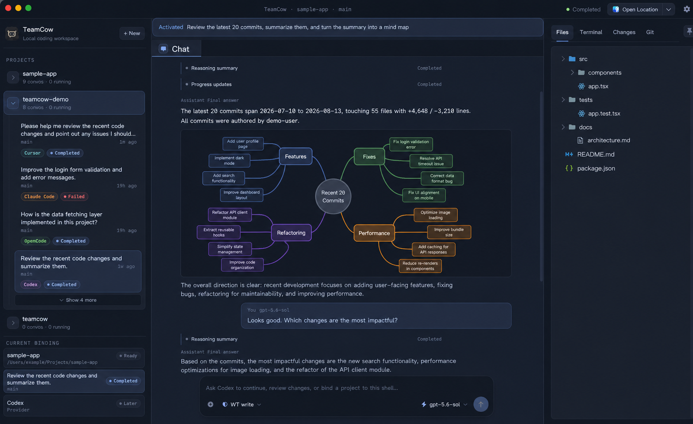
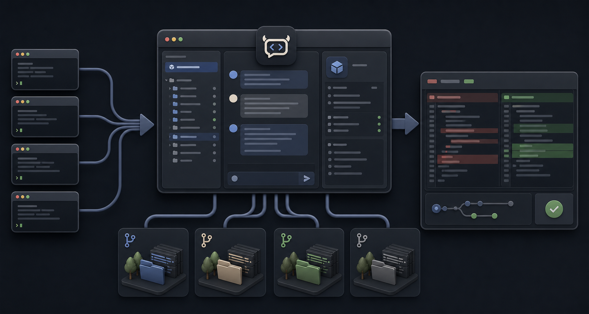

<p align="center">
  
</p>

<h1 align="center">TeamCow</h1>

<p align="center">
  <strong>Your coding agents. Their native power. One better workspace.</strong>
</p>

<p align="center">
  Bring the Codex, Claude Code, OpenCode, and Cursor Agent CLIs already installed<br>
  and authenticated on your Mac into one local-first, chat-first desktop workspace.
</p>

<p align="center">
  
  
  <a href="LICENSE"></a>
  
</p>

<p align="center">
  <a href="README.zh-CN.md">中文</a> · English
</p>



<p align="center"><em>Sanitized product visual based on the current TeamCow interface. Projects, paths, and conversations contain demo data.</em></p>

> [!TIP]
> If `codex`, `claude`, `opencode`, or `cursor-agent` already works in your terminal, it can work in TeamCow. There is no TeamCow account to create, no API key to enter again, and no provider authentication to migrate.

> [!IMPORTANT]
> TeamCow has currently been built and functionally verified only on macOS. Windows and Linux builds have not yet been validated and should not be considered supported platforms.

## Download the macOS preview

[Download TeamCow `v0.0.1` for Apple Silicon](https://github.com/chobitsX/teamCow/releases/tag/v0.0.1) from GitHub Releases. This is an unsigned, ad-hoc-signed preview build for macOS on Apple Silicon (`arm64`). Intel Macs, Windows, and Linux have not been validated, and automatic updates are not yet available.

1. Download `TeamCow-0.0.1-arm64.dmg` and drag TeamCow to `Applications`.
2. Try to open TeamCow once. If macOS blocks it, open **System Settings → Privacy & Security**, find the TeamCow notice, and choose **Open Anyway**.
3. Compare the DMG's SHA-256 checksum with `teamcow-release-manifest.json` attached to the release.

Only override macOS security when the DMG came from this repository's GitHub Release and its checksum matches. TeamCow does not require disabling Gatekeeper or removing quarantine attributes from the command line.

## What is TeamCow?

TeamCow is not another AI agent and it is not a model API proxy. It invokes provider CLIs already available on your Mac, leaving models, tools, authentication, permission prompts, and native execution to the provider. TeamCow adds project and conversation management, structured chat, Git worktree isolation, and a review workspace built around Files, Changes, Git, and Terminal.

That means a consistent desktop experience does not require replacing the agents you already trust. Providers keep doing the agent work; TeamCow makes multi-agent work easier to organize, run in parallel, and verify.

## Why TeamCow?

| What gets difficult today | What TeamCow adds |
| --- | --- |
| Agents are scattered across terminals and project context becomes hard to follow | A `Project → Conversation` workflow that binds each task to its provider, model, and execution target |
| A unified tool might replace mature agents with a reduced generic implementation | Native local CLIs keep their existing models, tools, authentication, and permission semantics |
| Multiple agents editing one checkout can conflict | Each conversation can use an isolated Git worktree for parallel execution |
| An agent says it is done, but the actual result is difficult to judge | Files, Changes, Git, and Terminal reveal the real files, diffs, state, and execution result |
| Raw terminal output is fragmented and hard to revisit | Provider output becomes chat messages, reasoning summaries, tool events, and run states |
| You do not want another service holding credentials or workflow data | TeamCow has no separate sign-in system and keeps projects, conversations, and run history local |

## Native agents, desktop workflow



<p align="center"><em>Conceptual workflow: connect local CLIs, work in isolated worktrees, and review real changes before merging.</em></p>

TeamCow keeps the product model intentionally simple:

```text
Project
└── Conversation
    ├── Native provider CLI + Model
    ├── Access mode
    ├── Working directory / Git worktree
    ├── Structured chat timeline
    └── Inspector (Files / Changes / Git / Terminal)
```

A project can contain multiple conversations. Each conversation is bound to one provider, model, and working directory or Git worktree, so agents can work in parallel without making Worktree a top-level concept users have to manage.

## Highlights

- **Bring your own agent:** connect Codex, Claude Code, OpenCode, and Cursor Agent already installed on your Mac—without a TeamCow account or duplicate authentication.
- **Keep native capabilities:** providers remain responsible for models, tools, authentication, permissions, and execution; TeamCow does not replace them with a generic agent.
- **Structured chat:** distinguish user messages, provider output, reasoning summaries, tool events, and state changes instead of dumping a raw terminal stream into chat.
- **Parallel worktrees:** bind conversations to independent Git worktrees to isolate work and compare results.
- **Review the result:** inspect what agents actually wrote through Files, Changes, Git, and diff views.
- **Take over when needed:** continue from the built-in Terminal or editor in the same working directory.
- **Local persistence:** store projects, conversations, run events, and artifacts in SQLite so partial output remains reviewable after failures or interruptions.
- **A macOS workbench:** English and Chinese interfaces, light/dark themes, desktop notifications, and a native window workflow.

## Supported providers

Install and authenticate at least one provider through its native CLI first. TeamCow treats the CLI's own version and authentication state as the source of truth for readiness; an auxiliary network probe does not override a confirmed native login.

| Provider | Local command | Official documentation |
| --- | --- | --- |
| Codex | `codex` | [openai/codex](https://github.com/openai/codex) |
| Claude Code | `claude` | [Claude Code docs](https://code.claude.com/docs/en/getting-started) |
| OpenCode | `opencode` | [OpenCode docs](https://opencode.ai/docs) |
| Cursor Agent | `cursor-agent` | [Cursor CLI docs](https://cursor.com/docs/cli/overview) |

If a provider is missing, unauthenticated, or misconfigured, TeamCow reports the reason and leaves authentication in the provider's native tooling.

## Quick start

### Requirements

- macOS, currently the only platform with a verified build and functional testing
- Node.js `22.22.2` (`.node-version` and `.nvmrc`)
- Yarn `1.22.22`, pinned by the root `packageManager` field
- Git
- Xcode Command Line Tools for Electron native modules
- At least one provider CLI that already works in your terminal

### Run from source

```bash
corepack enable
yarn install --frozen-lockfile
yarn dev
```

The first launch, or a Node/Electron version change, may take longer while native modules are rebuilt. If Electron starts like a regular Node process, see [desktop development troubleshooting](docs/desktop-dev-troubleshooting.md).

### Verify a change

```bash
yarn typecheck
yarn lint
yarn test
yarn i18n:check
yarn workspace @teamcow/desktop smoke
```

## Project status

TeamCow is currently an early `0.0.1` project intended primarily for source builds and developer evaluation on macOS. The core Project, Conversation, Provider, Worktree, Chat, and Inspector workflows are available; production signing, notarization, and the update feed are still being prepared. Windows and Linux builds have not yet undergone build or functional verification.

Build a local macOS package with:

```bash
yarn workspace @teamcow/desktop package:mac
```

Artifacts are written to `apps/desktop/release/`. Local packages are unsigned and unnotarized by default and should not be distributed as production releases before completing the [macOS V1 release checklist](docs/macos-v1-release-checklist.md).

## Local data and security

- TeamCow stores `teamcow.sqlite`, conversation attachments, and application logs under Electron's `userData` directory. These files are not part of the repository.
- TeamCow reuses native provider authentication and does not ask you to paste tokens or API keys into a TeamCow account system.
- Logs, issues, and screenshots must not contain provider configuration, user project source, databases, conversation content, or identifying local paths.
- `full-access` enables the provider's native high-trust execution mode. Use it only when you understand the provider's behavior and trust the current project.
- Do not open a public issue for a vulnerability. Follow the private reporting process in [SECURITY.md](SECURITY.md).

## Repository layout

```text
apps/desktop/                 Electron + React desktop application
packages/db/                  SQLite / Drizzle schema and migrations
packages/shared-types/        Cross-process types and Zod contracts
packages/i18n-resources/      English and Chinese resources
scripts/                      Repository checks and publishing scripts
docs/                         Architecture, troubleshooting, release, and design records
app-screenshots/              Sanitized product visuals used by the README
```

File icons are generated from the pinned `material-icon-theme` dependency before `yarn dev` and `yarn build`, keeping more than 1,000 derived SVGs out of source control. See the [architecture overview](docs/architecture.md) for runtime boundaries.

## Contributing

Read [CONTRIBUTING.md](CONTRIBUTING.md) before opening a pull request. Use the issue and pull request templates, and remove tokens, local paths, user code, and conversation content from logs and screenshots.

Maintainers publish the public `main` branch as snapshots from a separate `dev` history. See the [public snapshot publishing workflow](docs/open-source-publishing.md) for its safety constraints.

## License and trademarks

Copyright 2026 chobitsX.

TeamCow is open source under the [Apache License 2.0](LICENSE). See [NOTICE](NOTICE) for copyright and attribution information. Third-party dependencies, assets, and marks remain subject to their own terms as documented in [THIRD_PARTY_NOTICES.md](THIRD_PARTY_NOTICES.md). TeamCow is not affiliated with or endorsed by OpenAI, Anthropic, OpenCode, or Cursor; Apache-2.0 does not grant rights to TeamCow or third-party trademarks.
