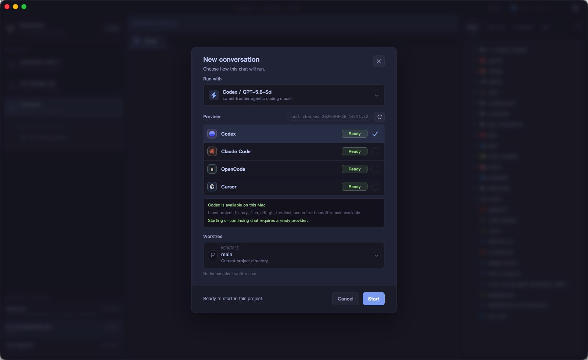

<p align="center">
  
</p>

<h1 align="center">TeamCow</h1>

<p align="center">
  本地优先、对话优先的 macOS AI 编程工作台。
</p>

<p align="center">
  中文 · <a href="README.en.md">English</a>
</p>

> [!IMPORTANT]
> TeamCow 当前处于早期版本（`0.0.0`），以 macOS 源码构建和开发者试用为主。正式发布前请阅读下方的安全说明和发布状态。



## TeamCow 是什么

TeamCow 把已经安装在本机的 AI coding agent 连接到一个统一的桌面工作台。它不重新实现 agent，也不接管这些工具的账号和认证；你继续使用 provider 原生 CLI，TeamCow 负责项目、会话、执行目标、过程观察与结果审查。

产品心智保持为 `Project -> Conversation`：一个项目可以有多个会话，每个会话固定绑定 provider、model 和工作目录或 Git worktree，便于隔离执行并比较结果。

## 主要能力

- 在同一个界面中使用 Codex、Claude Code、OpenCode 和 Cursor Agent。
- 将每个会话绑定到项目主目录、已有 worktree 或新建 worktree。
- 在聊天时间线中查看归一化后的输出、工具活动和运行状态。
- 通过 Files、Changes、Git 和 Terminal 检查或接管本地工作。
- 本地 SQLite 持久化项目、会话、运行事件和产物。
- 中英文界面、浅色/深色主题和 macOS 系统通知。

## 工作方式

```text
Project
└── Conversation
    ├── Provider + Model
    ├── Access mode
    ├── Working directory / Git worktree
    ├── Chat timeline
    └── Inspector (Files / Changes / Git / Terminal)
```

TeamCow 通过 provider 原生状态判断可用性。请先独立安装并登录至少一个受支持的工具：

| Provider | 本机命令 | 官方资料 |
| --- | --- | --- |
| Codex | `codex` | [openai/codex](https://github.com/openai/codex) |
| Claude Code | `claude` | [Claude Code 文档](https://docs.anthropic.com/en/docs/claude-code/getting-started) |
| OpenCode | `opencode` | [OpenCode 文档](https://opencode.ai/docs) |
| Cursor Agent | `cursor-agent` | [Cursor CLI 文档](https://cursor.com/docs/cli/overview) |

## 本地开发

### 环境要求

- macOS（V1 的首要支持平台）
- Node.js `22.22.2`（见 `.node-version` 和 `.nvmrc`）
- Yarn `1.22.22`（由根目录 `packageManager` 固定）
- Git
- Xcode Command Line Tools（用于 Electron 原生模块）
- 至少一个已安装并完成原生认证的 provider CLI

### 启动

```bash
corepack enable
yarn install --frozen-lockfile
yarn dev
```

首次启动或 Node/Electron 版本变化后，原生模块重建可能需要一些时间。若 Electron 表现得像普通 Node 进程，请先阅读[桌面开发排障](docs/desktop-dev-troubleshooting.md)。

### 验证

```bash
yarn typecheck
yarn lint
yarn test
yarn i18n:check
yarn build
yarn workspace @teamcow/desktop smoke
```

### 构建 macOS 安装包

```bash
yarn workspace @teamcow/desktop package:mac
```

产物会写入 `apps/desktop/release/`。默认本地构建未签名、未公证，自动更新地址也仍是占位配置，不应当作为正式发行包直接分发。正式发布请按 [macOS V1 发布验收清单](docs/macos-v1-release-checklist.md)完成签名、公证、更新源和人工验收。

## 仓库结构

```text
apps/desktop/                 Electron + React 桌面应用
packages/db/                  SQLite / Drizzle schema 与 migration
packages/shared-types/        跨进程类型与 Zod 契约
packages/i18n-resources/      中文和英文资源
scripts/                      仓库级检查与发布脚本
docs/                         架构、排障、发布和设计记录
app-screenshots/              公开文档使用的脱敏截图
```

文件图标来源于锁定版本的 `material-icon-theme`，会在 `yarn dev` 和 `yarn build` 前自动生成，不作为 1,000 多个派生文件提交到仓库。更多边界说明见[架构概览](docs/architecture.md)。

## 本地数据与安全

- TeamCow 会在 Electron 的 `userData` 目录中保存 `teamcow.sqlite`、会话附件和应用日志；这些内容不会进入仓库。
- TeamCow 调用你本机已安装的 provider，并沿用其认证状态。不要把 token、provider 配置、数据库、日志或真实项目截图提交到 issue。
- `full-access` 会启用 provider 原生的高信任执行能力。只应在你理解对应 provider 行为并信任当前项目时使用。
- 发现安全问题时请不要创建公开 issue，按[安全策略](SECURITY.md)私下报告。

## 参与贡献

请先阅读[贡献指南](CONTRIBUTING.md)。Bug 报告和 Pull Request 请使用仓库模板，并在提交日志前移除 token、本机路径、用户代码和会话内容。

项目维护者通过独立的 `dev` 开发历史生成公开 `main` 快照；流程和安全约束见[公开仓库快照发布流程](docs/open-source-publishing.md)。

第三方组件和品牌说明见 [THIRD_PARTY_NOTICES.md](THIRD_PARTY_NOTICES.md)。TeamCow 与 OpenAI、Anthropic、OpenCode 和 Cursor 不存在隶属或官方背书关系；相关名称和标志归各自权利人所有。

## 许可证

Copyright 2026 chobitsX。

TeamCow 采用 [Apache License 2.0](LICENSE) 开源，版权与归属信息见 [NOTICE](NOTICE)。第三方依赖、资源和商标仍适用其各自条款，详见 [THIRD_PARTY_NOTICES.md](THIRD_PARTY_NOTICES.md)。Apache-2.0 不授予 TeamCow 或第三方商标的使用权。
