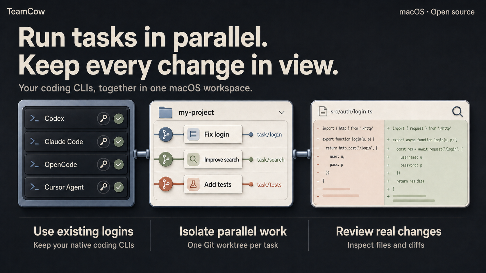

<p align="center">
  
</p>

<h1 align="center">TeamCow</h1>

<p align="center">
  <strong>A macOS desktop GUI for Codex, Claude Code, OpenCode, and Cursor Agent.</strong>
</p>

<p align="center">
  Reuse your CLI logins, run tasks in isolated Git worktrees,<br>
  and review code changes in one local-first AI coding workspace.
</p>

<p align="center">
  <a href="https://github.com/chobitsX/teamCow/releases/download/v0.0.3/TeamCow-0.0.3-arm64.dmg"></a>
</p>

<p align="center">
  v0.0.3 preview · Developer ID signed · Apple notarized<br>
  <a href="#get-started">Get started</a> · <a href="https://github.com/chobitsX/teamCow/releases/tag/v0.0.3">Release notes</a> · <a href="README.zh-CN.md">中文</a>
</p>

<p align="center">
  
  <a href="LICENSE"></a>
</p>



<p align="center"><em>AI-generated concept illustration of the workflow. See the workspace preview below for the interface.</em></p>

## Why TeamCow?

When coding tasks spread across terminals, it gets harder to track which agent is working where and what it changed. TeamCow organizes your existing coding CLIs into projects and conversations, with the task, its working directory, and its output kept together.

- **Keep the tools you already use.** Connect your installed Codex, Claude Code, OpenCode, or Cursor Agent CLI with its existing login, models, tools, and permission prompts. There is no TeamCow account to create.
- **Move several tasks forward.** Give each conversation its own Git worktree so a bug fix, a feature, and a test task can run in separate working directories. Review and reconcile changes when you bring them together.
- **See what actually changed.** Read structured chat and tool events, inspect files and diffs, and take over in the built-in terminal. Conversation history and received output stay available locally after an interruption.

## Get started

You need an Apple Silicon Mac, Git, and at least one supported coding CLI installed and authenticated. The TeamCow installer includes its own runtime; Node.js and Yarn are only needed for TeamCow source development. Your chosen CLI may have its own requirements.

1. **Install TeamCow.** [Download the macOS DMG](https://github.com/chobitsX/teamCow/releases/download/v0.0.3/TeamCow-0.0.3-arm64.dmg), open it, and drag TeamCow to `Applications`.
2. **Bring a project.** Open TeamCow and import an existing local Git repository. TeamCow detects your available provider CLIs and their login state.
3. **Start a conversation.** Choose a provider and model, then use the project directory or an isolated Git worktree. Follow the task in chat and inspect its changes alongside it.

The `v0.0.3` Apple Silicon (`arm64`) preview is signed with Developer ID and notarized by Apple. Intel Macs, Windows, and Linux have not been validated. Updates currently require downloading a new release.

<details>
<summary>Verify your download or troubleshoot installation</summary>

Compare the DMG's SHA-256 checksum with `teamcow-release-manifest.json` on the [release page](https://github.com/chobitsX/teamCow/releases/tag/v0.0.3). macOS can verify both the Developer ID signature and the stapled Apple notarization ticket.

If macOS reports a verification problem, confirm the download source and checksum before reporting it. TeamCow does not require disabling Gatekeeper, choosing **Open Anyway**, or removing quarantine attributes.

</details>

## Inside the workspace


<p align="center"><em>Sanitized product visual based on the current TeamCow interface. Projects, paths, and conversations contain demo data.</em></p>

TeamCow keeps the product model intentionally simple:

```text
Project
└── Conversation
    ├── Native provider CLI + Model
    ├── Access mode
    ├── Working directory / Git worktree
    ├── Structured chat timeline
    └── Inspector (Files / Changes / Git / Terminal)
```

A project can contain multiple conversations. Each conversation is bound to one provider, model, and working directory or Git worktree, so agents can work in parallel without making Worktree a top-level concept users have to manage.

## Highlights

- **Bring your own agent:** connect Codex, Claude Code, OpenCode, and Cursor Agent already installed on your Mac—without a TeamCow account or duplicate authentication.
- **Keep native capabilities:** providers remain responsible for models, tools, authentication, permissions, and execution; TeamCow does not replace them with a generic agent.
- **Structured chat:** distinguish user messages, provider output, reasoning summaries, tool events, and state changes instead of dumping a raw terminal stream into chat.
- **Parallel worktrees:** bind conversations to independent Git worktrees to isolate work and compare results.
- **Review the result:** inspect what agents actually wrote through Files, Changes, Git, and diff views.
- **Take over when needed:** continue from the built-in Terminal or editor in the same working directory.
- **Local persistence:** store projects, conversations, run events, and artifacts in SQLite so partial output remains reviewable after failures or interruptions.
- **A macOS workbench:** English and Chinese interfaces, light/dark themes, desktop notifications, and a native window workflow.

## Supported providers

Install and authenticate at least one provider through its native CLI first. TeamCow treats the CLI's own version and authentication state as the source of truth for readiness; an auxiliary network probe does not override a confirmed native login.

| Provider | Local command | Official documentation |
| --- | --- | --- |
| Codex | `codex` | [openai/codex](https://github.com/openai/codex) |
| Claude Code | `claude` | [Claude Code docs](https://code.claude.com/docs/en/getting-started) |
| OpenCode | `opencode` | [OpenCode docs](https://opencode.ai/docs) |
| Cursor Agent | `cursor-agent` | [Cursor CLI docs](https://cursor.com/docs/cli/overview) |

If a provider is missing, unauthenticated, or misconfigured, TeamCow reports the reason and leaves authentication in the provider's native tooling.

## Develop from source

### Build requirements

- macOS, currently the only platform with a verified build and functional testing
- Node.js `22.22.2` (`.node-version` and `.nvmrc`)
- Yarn `1.22.22`, pinned by the root `packageManager` field
- Git
- Xcode Command Line Tools for Electron native modules
- At least one provider CLI that already works in your terminal

### Run from source

```bash
corepack enable
yarn install --frozen-lockfile
yarn dev
```

The first launch, or a Node/Electron version change, may take longer while native modules are rebuilt. If Electron starts like a regular Node process, see [desktop development troubleshooting](docs/desktop-dev-troubleshooting.md).

### Verify a change

```bash
yarn typecheck
yarn lint
yarn test
yarn i18n:check
yarn workspace @teamcow/desktop smoke
```

## Project status

TeamCow is currently an early `0.0.3` project intended primarily for developer evaluation on macOS. The core Project, Conversation, Provider, Worktree, Chat, and Inspector workflows are available. macOS preview downloads are signed with Developer ID and notarized by Apple; the automatic update feed is not yet available. Windows and Linux builds have not yet undergone build or functional verification.

Build a local macOS package with:

```bash
yarn workspace @teamcow/desktop package:mac
```

Artifacts are written to `apps/desktop/release/`. Local packages are unsigned and unnotarized by default and should not be distributed as production releases before completing the [macOS V1 release checklist](docs/macos-v1-release-checklist.md).

## Local data and security

- TeamCow stores `teamcow.sqlite`, conversation attachments, and application logs under Electron's `userData` directory. These files are not part of the repository.
- TeamCow reuses native provider authentication and does not ask you to paste tokens or API keys into a TeamCow account system.
- Logs, issues, and screenshots must not contain provider configuration, user project source, databases, conversation content, or identifying local paths.
- `full-access` enables the provider's native high-trust execution mode. Use it only when you understand the provider's behavior and trust the current project.
- Do not open a public issue for a vulnerability. Follow the private reporting process in [SECURITY.md](SECURITY.md).

## Repository layout

```text
apps/desktop/                 Electron + React desktop application
packages/db/                  SQLite / Drizzle schema and migrations
packages/shared-types/        Cross-process types and Zod contracts
packages/i18n-resources/      English and Chinese resources
scripts/                      Repository checks and publishing scripts
docs/                         Architecture, troubleshooting, release, and design records
app-screenshots/              Sanitized product visuals used by the README
```

File icons are generated from the pinned `material-icon-theme` dependency before `yarn dev` and `yarn build`, keeping more than 1,000 derived SVGs out of source control. See the [architecture overview](docs/architecture.md) for runtime boundaries.

## Contributing

Read [CONTRIBUTING.md](CONTRIBUTING.md) before opening a pull request. Use the issue and pull request templates, and remove tokens, local paths, user code, and conversation content from logs and screenshots.

Maintainers publish the public `main` branch as snapshots from a separate `dev` history. See the [public snapshot publishing workflow](docs/open-source-publishing.md) for its safety constraints.

## License and trademarks

Copyright 2026 chobitsX.

TeamCow is open source under the [Apache License 2.0](LICENSE). See [NOTICE](NOTICE) for copyright and attribution information. Third-party dependencies, assets, and marks remain subject to their own terms as documented in [THIRD_PARTY_NOTICES.md](THIRD_PARTY_NOTICES.md). TeamCow is not affiliated with or endorsed by OpenAI, Anthropic, OpenCode, or Cursor; Apache-2.0 does not grant rights to TeamCow or third-party trademarks.
