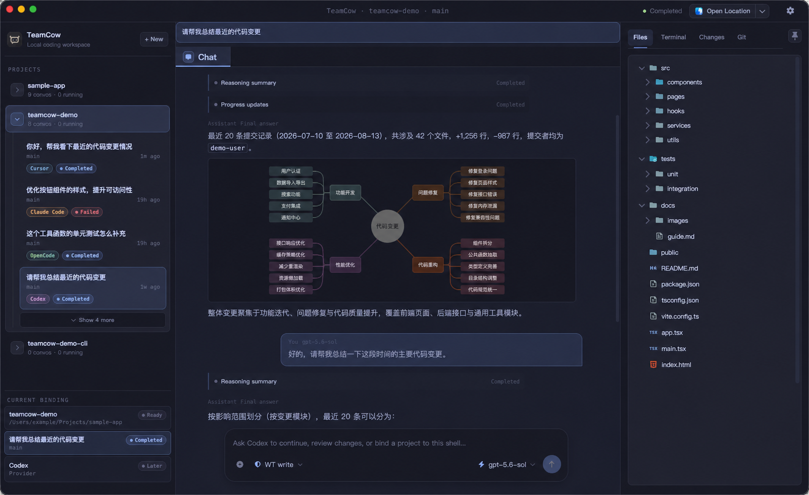

<p align="center">
  
</p>

<h1 align="center">TeamCow</h1>

<p align="center">
  <strong>你的 coding agent，原生能力，一个更好用的工作台。</strong>
</p>

<p align="center">
  把本机已经安装并完成认证的 Codex、Claude Code、OpenCode 和 Cursor Agent<br>
  带进一个本地优先、对话优先的 macOS 桌面工作台。
</p>

<p align="center">
  
  
  <a href="LICENSE"></a>
  
</p>

<p align="center">
  中文 · <a href="README.md">English</a>
</p>



<p align="center"><em>基于当前产品界面生成的脱敏演示图；项目、路径和对话均为示例数据。</em></p>

> [!TIP]
> 如果 `codex`、`claude`、`opencode` 或 `cursor-agent` 已经能在你的终端正常工作，它就可以接入 TeamCow。无需注册 TeamCow，无需重复填写 API Key，也无需把现有认证迁移到另一套账号系统。

> [!IMPORTANT]
> TeamCow 目前只在 macOS 上完成构建与功能验证。Windows 和 Linux 版本尚未构建确认，当前不应视为已支持平台。

## 下载 macOS 预览版

请从 GitHub Releases [下载适用于 Apple Silicon 的 TeamCow `v0.0.3`](https://github.com/chobitsX/teamCow/releases/tag/v0.0.3)。macOS Apple Silicon（`arm64`）预览包已使用 Developer ID 证书签名并通过 Apple 公证；Intel Mac、Windows 和 Linux 尚未验证，目前也不提供自动更新。

1. 下载 `TeamCow-0.0.3-arm64.dmg`，并将 TeamCow 拖入“应用程序”。
2. 正常打开 TeamCow；macOS 可以验证 Developer ID 签名和已装订的 Apple 公证票据。
3. 使用 Release 附带的 `teamcow-release-manifest.json` 核对 DMG 的 SHA-256 校验值。

如果 macOS 报告无法验证签名或公证，请先确认 DMG 来自本仓库 GitHub Release 且校验值一致，再提交问题。TeamCow 不要求关闭 Gatekeeper、选择“仍要打开”，也不要求通过命令行移除隔离属性。

## TeamCow 是什么

TeamCow 不是新的 AI agent，也不是模型 API 的中转服务。它直接调用本机已有的 provider CLI，让 provider 继续负责模型、工具、认证、权限确认和原生执行；TeamCow 在此基础上增加项目与 Conversation 管理、结构化 Chat、Git worktree 隔离，以及 Files、Changes、Git、Terminal 组成的结果审查工作台。

这意味着统一的桌面体验不需要以替换原生 agent 为代价：你继续使用已经信任的 provider 能力，TeamCow 负责让多 Agent 工作变得更清晰、更可并行，也更容易检查。

## 为什么使用 TeamCow

| 你现在可能遇到的问题 | TeamCow 提供的工作方式 |
| --- | --- |
| 多个 Agent 分散在不同终端，项目上下文容易混乱 | 用 `Project → Conversation` 统一组织任务、Provider、Model 和执行目标 |
| 担心统一工具会把成熟 Agent 换成能力缩水的通用实现 | 直接运行本机原生 CLI，沿用已有模型、工具、认证与权限语义 |
| 多个 Agent 同时修改同一份代码容易冲突 | 每个 Conversation 可以绑定独立 Git worktree，隔离并行执行 |
| Agent 表示“已经完成”，但真实改动仍然难以判断 | 在 Files、Changes、Git 和 Terminal 中检查文件、Diff、状态与运行结果 |
| 终端输出零散，很难回顾工具调用与失败过程 | 将输出归一化为 Chat 消息、推理摘要、工具事件和运行状态 |
| 不希望额外托管凭据或上传项目工作流数据 | TeamCow 不提供独立登录体系，项目、Conversation 和运行记录保存在本机 |

## 原生 Agent，桌面工作流


<p align="center"><em>概念工作流：本机 CLI 接入 TeamCow，在隔离 worktree 中并行工作，并在合并前审查真实改动。</em></p>

TeamCow 的核心模型保持简单：

```text
Project
└── Conversation
    ├── Native provider CLI + Model
    ├── Access mode
    ├── Working directory / Git worktree
    ├── Structured chat timeline
    └── Inspector (Files / Changes / Git / Terminal)
```

一个 Project 可以包含多个 Conversations。每个 Conversation 固定绑定一个 provider、一个 model 和一个工作目录或 Git worktree，因此多个 Agent 可以在同一项目下并行工作，而不会把 Worktree 暴露成用户必须管理的顶层概念。

## 核心能力

- **Bring Your Own Agent**：连接本机已有的 Codex、Claude Code、OpenCode 和 Cursor Agent，不要求 TeamCow 账号或重复认证。
- **保留原生能力**：Provider 继续决定模型、工具、认证、权限和执行行为；TeamCow 不重新实现通用 Agent。
- **结构化 Chat**：区分用户消息、Provider 输出、推理摘要、工具事件和状态变化，不把终端原始流直接塞进对话。
- **并行 Worktree**：为不同 Conversation 绑定独立 worktree，隔离修改并比较结果。
- **结果审查**：在 Files、Changes、Git 和 Diff 视图中检查 Agent 真正写入的内容。
- **人工接管**：通过内置 Terminal 或编辑器继续处理当前工作目录中的任务。
- **本地持久化**：使用 SQLite 保存项目、Conversation、运行事件和产物，失败或中断后仍可继续审查。
- **macOS 工作台体验**：中英文界面、浅色/深色主题、桌面通知和原生窗口工作流。

## 支持的 Provider

请先在终端中独立安装并完成至少一个 provider 的原生认证。TeamCow 会优先使用 CLI 自己的版本和登录状态判断是否可用，不会用辅助网络探测覆盖已经确认的原生认证结果。

| Provider | 本机命令 | 官方资料 |
| --- | --- | --- |
| Codex | `codex` | [openai/codex](https://github.com/openai/codex) |
| Claude Code | `claude` | [Claude Code 文档](https://code.claude.com/docs/en/getting-started) |
| OpenCode | `opencode` | [OpenCode 文档](https://opencode.ai/docs) |
| Cursor Agent | `cursor-agent` | [Cursor CLI 文档](https://cursor.com/docs/cli/overview) |

如果 Provider 尚未安装、未认证或配置无效，TeamCow 会显示不可用原因，并让认证继续在 Provider 原生工具中完成。

## 快速开始

### 环境要求

- macOS（当前唯一完成构建与功能验证的平台）
- Node.js `22.22.2`（见 `.node-version` 和 `.nvmrc`）
- Yarn `1.22.22`（由根目录 `packageManager` 固定）
- Git
- Xcode Command Line Tools（用于 Electron 原生模块）
- 至少一个已经可以在终端正常使用的 provider CLI

### 从源码启动

```bash
corepack enable
yarn install --frozen-lockfile
yarn dev
```

首次启动或 Node/Electron 版本变化后，原生模块重建可能需要一些时间。若 Electron 表现得像普通 Node 进程，请先阅读[桌面开发排障](docs/desktop-dev-troubleshooting.md)。

### 验证改动

```bash
yarn typecheck
yarn lint
yarn test
yarn i18n:check
yarn workspace @teamcow/desktop smoke
```

## 产品状态

TeamCow 当前处于早期版本（`0.0.3`），以 macOS 开发者试用为主。核心 Project、Conversation、Provider、Worktree、Chat 与 Inspector 工作流已经可用。macOS 预览包已使用 Developer ID 正式签名并通过 Apple 公证；自动更新源尚未开放。Windows 和 Linux 版本尚未进行构建与功能验证。

本地构建 macOS 安装包：

```bash
yarn workspace @teamcow/desktop package:mac
```

产物写入 `apps/desktop/release/`。默认本地构建未签名、未公证，不应直接作为正式发行包分发。发布前请完成 [macOS V1 发布验收清单](docs/macos-v1-release-checklist.md)。

## 本地数据与安全

- TeamCow 在 Electron `userData` 目录中保存 `teamcow.sqlite`、Conversation 附件和应用日志，这些内容不会进入仓库。
- TeamCow 沿用本机 Provider 的认证状态，不要求把 Token 或 API Key 粘贴到 TeamCow 账号系统中。
- 日志、Issue 和截图不应包含 Provider 配置、用户项目代码、数据库、Conversation 内容或真实本机路径。
- `full-access` 会启用 Provider 原生的高信任执行能力，只应在理解对应 Provider 行为并信任当前项目时使用。
- 发现安全问题时不要创建公开 Issue，请按[安全策略](SECURITY.md)私下报告。

## 仓库结构

```text
apps/desktop/                 Electron + React 桌面应用
packages/db/                  SQLite / Drizzle schema 与 migration
packages/shared-types/        跨进程类型与 Zod 契约
packages/i18n-resources/      中文和英文资源
scripts/                      仓库级检查与发布脚本
docs/                         架构、排障、发布和设计记录
app-screenshots/              README 使用的脱敏产品演示图
```

文件图标来源于锁定版本的 `material-icon-theme`，会在 `yarn dev` 和 `yarn build` 前自动生成，不提交 1,000 多个派生 SVG。更多边界说明见[架构概览](docs/architecture.md)。

## 参与贡献

请先阅读[贡献指南](CONTRIBUTING.md)。Bug 报告和 Pull Request 请使用仓库模板，并在提交日志或截图前移除 Token、本机路径、用户代码和 Conversation 内容。

项目维护者通过独立的 `dev` 开发历史生成公开 `main` 快照；流程和安全约束见[公开仓库快照发布流程](docs/open-source-publishing.md)。

## 许可证与商标

Copyright 2026 chobitsX。

TeamCow 采用 [Apache License 2.0](LICENSE) 开源，版权与归属信息见 [NOTICE](NOTICE)。第三方依赖、资源和商标仍适用其各自条款，详见 [THIRD_PARTY_NOTICES.md](THIRD_PARTY_NOTICES.md)。TeamCow 与 OpenAI、Anthropic、OpenCode 和 Cursor 不存在隶属或官方背书关系；Apache-2.0 不授予 TeamCow 或第三方商标的使用权。
