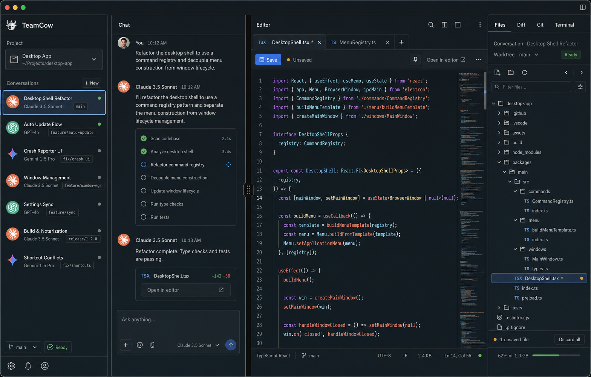

# Files Editor Workspace

## Context

TeamCow 当前右侧 Inspector 的 `Files` 面板已经能展示当前 conversation 绑定 worktree 下的项目文件树。点击文件时，现有行为会调用 `openConversationHandoff`，把文件交给已选择的外部编辑器打开。

这个体验会打断 TeamCow 的主工作流。用户希望点击 `Files` 文件后直接在 TeamCow 内打开和编辑，同时参考 `references/upstream/superset` 中的文件编辑实现。Superset 的可借鉴点不是完整 pane 系统，而是：

- `FilePane` 将文件视为可独立打开的文档 pane。
- `fileDocumentStore` 维护 loading、not-found、too-large、binary、dirty、revision、save conflict 等状态。
- `CodeView` 使用 CodeMirror 承载真实代码编辑。
- 文件写入通过 host filesystem API，保存时带 revision precondition 来发现外部变更冲突。

TeamCow 应吸收这些模式，但保持自身 `Project -> Conversation` 主心智、chat-first 中栏、右侧 Inspector 审查路径，以及 renderer 不直接访问文件系统的架构边界。

## Visual Reference

Use the generated UI reference as the visual target for this feature:

The implementation should follow the image's structure and tone: left Project / Conversation navigation, center `Chat | Editor` split, right Inspector with `Files` active, compact professional density, graphite dark workbench styling, low-saturation blue focus states, and explicit editor states for tabs, Save, dirty marker, external open, and selected file tree row.

## Goals

- 点击右侧 Inspector `Files` 的文件后，在 TeamCow 中间栏内打开文件编辑器，而不是默认打开外部 IDE。
- 没有打开文件时，中间栏只有 Chat，不显示 editor 占位。
- 第一次打开文件后，中间栏变为 `Chat | Editor` split，默认各占 50%，支持拖动调整比例。
- 支持 IDE 式 preview tab：普通点击复用预览 tab；编辑后自动固定；双击文件或点击 pin 可手动固定。
- 支持多个固定 editor tabs、dirty 标记、关闭 dirty tab 确认、手动保存和保存冲突处理。
- provider run 运行中时，文件可打开查看，但编辑器只读，不能修改或保存。
- 文件读写必须 conversation-bound：renderer 只传 `conversationId + relative filePath`，main 侧解析绑定 worktree 并校验路径。
- 保留外部编辑器入口，作为 editor 标题栏中的显式动作。

## Non-Goals

- 不做文件新建、重命名、删除、复制、拖拽移动等文件管理操作。
- 不把 Worktree 提升为用户侧主导航层级。
- 不移植 Superset 的完整 pane layout、workspace filesystem router、watch bridge 或 view registry。
- 不在 renderer 中直接访问 `fs`、`git`、`child_process` 或 provider 进程。
- 不把 editor 保存行为写成 chat message、run event 或 artifact。
- 不在本设计中实现 autosave。

## Product Decisions

- **Layout:** 未打开文件时只显示 Chat。打开至少一个文件后，中间栏显示 `Chat | Editor` split。
- **Default width:** Chat 和 Editor 默认 50/50。用户拖动后，比例在当前 app session 内保留。
- **Tab behavior:** 采用 preview tab + pinned tab。单击文件打开或替换预览 tab；双击或 pin 固定；编辑后自动固定。
- **Save model:** 只支持手动保存，入口为 `Cmd+S` 和 Save 按钮。
- **Run-active rule:** 当前 conversation 的 provider run 正在运行时，editor 为只读。main 侧保存命令也必须拒绝运行中 conversation 的写入。
- **Scope:** 只编辑已有文本文件。文件管理后续单独设计。

## Architecture

### Shared Contracts

在 `packages/shared-types/src/index.ts` 增加 conversation-bound 文件文档契约。

Inputs:

- `readConversationFileInputSchema`
  - `conversationId: string`
  - `filePath: string`
  - `maxBytes?: number` as a renderer-provided text read limit; main uses the default limit when it is omitted.
- `writeConversationFileInputSchema`
  - `conversationId: string`
  - `filePath: string`
  - `content: string`
  - `precondition?: { ifMatch: string }`

Read result states:

- `text`: includes `content`, `revision`, `byteLength`, `modifiedAt`, and `encoding`.
- `binary`: includes metadata but no editable content.
- `too-large`: includes metadata and the configured byte limit.
- `not-found`: file no longer exists.
- `is-directory`: path resolves to a directory.
- `error`: structured `AppError`.

Write result states:

- `saved`: includes new `revision`, `byteLength`, and `modifiedAt`.
- `conflict`: current disk revision differs from `ifMatch`; includes current revision and `currentContent`, where `currentContent` is the current disk text when it is readable within the text limit and `null` otherwise.
- `not-found`, `readonly`, `error`: structured failure states.

Desktop commands:

- `readConversationFile`
- `writeConversationFile`

Preload API:

- `window.teamcow.readConversationFile(input)`
- `window.teamcow.writeConversationFile(input)`

### Main Process

`ProjectService` owns the host-side file operations.

Read flow:

1. Parse command input with zod.
2. Resolve `conversationId -> conversation -> worktree`.
3. Resolve `filePath` relative to the worktree real path.
4. Reject absolute paths, empty paths, path traversal, symlink escapes, directories, missing files, unreadable files, binary files, and files above the text read limit.
5. Read UTF-8 text content for supported text files.
6. Return a revision token based on stable file metadata such as real path, `mtimeMs`, size, and inode when available.

Write flow:

1. Parse command input with zod.
2. Resolve the same conversation-bound target.
3. Reject writes when the conversation run status is `running`.
4. Reject binary, directory, missing, unreadable, or unwritable targets.
5. Compare the current disk revision with `precondition.ifMatch`.
6. On mismatch, return `conflict` instead of overwriting.
7. On match, write UTF-8 content and return the new revision.

The main process should use existing `pathErrorFor`, `isPathInsideRoot`, and handoff containment patterns where possible.

### Renderer

The renderer adds an editor workspace beside the chat area without changing the right Inspector role.

New units:

- `EditorWorkspace`
  - Owns `Chat | Editor` split rendering.
  - Renders only Chat when no editor tabs are open.
  - Persists the split ratio in session state.
- `EditorTabs`
  - Owns active tab, preview tab, pinned tabs, dirty labels, close actions, and pin action.
- `FileEditorPane`
  - Renders loading, text editor, binary, too-large, not-found, read-only, conflict, and error states.
- `useConversationFileDocument` or `conversation-file-document-store`
  - Owns document lifecycle, draft content, saved content, revision, dirty state, pending save, save errors, and conflicts.
- `conversation-file-editor-model`
  - Pure helpers for tab transitions, preview replacement, dirty close guards, and stale request checks.

Existing `DesktopShell` should orchestrate these units, not absorb their internal logic. If needed, existing project file tree helpers can be moved to a small model file before wiring editor behavior.

## UX

### Opening Files

- Single-click a file in Inspector `Files`:
  - If no editor is open, create the `Chat | Editor` split and open the file as preview.
  - If a clean preview tab exists, replace it.
  - If the preview tab is dirty, pin it first, then open the new file as preview.
- Double-click a file:
  - Open or focus it as pinned.
- Clicking an already open file:
  - Focus the existing tab. Do not duplicate tabs for the same `conversationId + filePath`.

### Tabs

- Preview tab is visually distinct but not noisy.
- Pinned tabs can coexist.
- Dirty tabs show `*` and Save enabled.
- Closing a clean tab closes immediately.
- Closing a dirty tab opens a localized confirmation with Save, Discard, and Cancel.
- Closing the last tab removes Editor and returns the middle area to pure Chat.

### Editing

- Text files render in CodeMirror with line numbers, basic code editing, undo/redo, search, and `Cmd+S`.
- Syntax highlighting is extension-based and intentionally modest for the first implementation.
- Provider run active state sets editor read-only and hides or disables write actions with clear text: run active, editing paused.
- Binary and too-large files are not editable. They show an explanation and an explicit external editor button.
- External editor button calls existing conversation handoff using only `conversationId + filePath`.

### Split

- The middle area split starts at 50/50 on first file open.
- The handle is keyboard and pointer accessible.
- Chat and Editor both have minimum widths.
- If the app window becomes narrow, the layout preserves Chat usability and allows Editor content to scroll instead of overlapping.

## Data Flow

### Read

1. User clicks a `Files` tree row.
2. Renderer opens or focuses an editor tab.
3. `useConversationFileDocument` calls `readConversationFile({ conversationId, filePath })`.
4. Main resolves and reads the file under the conversation worktree.
5. Renderer stores `content`, `revision`, and clean baseline.
6. Editor renders text or a structured non-text/error state.

### Edit

1. User types in CodeMirror.
2. Document store updates draft content.
3. If the tab was preview, it becomes pinned.
4. Dirty state is derived by comparing draft content with the saved baseline.

### Save

1. User presses `Cmd+S` or Save.
2. Renderer checks that the active conversation is not running.
3. Renderer calls `writeConversationFile` with current draft and `ifMatch` revision.
4. Main rejects running conversations as a safety backstop.
5. Main compares disk revision.
6. On save success, renderer updates baseline and revision.
7. On conflict, renderer shows conflict actions:
   - Reload from disk
   - Overwrite
   - Keep editing

## Error Handling

All user-visible labels and messages belong in `packages/i18n-resources/src/inspector/en.json` and `zh.json`, or `errors/en.json` and `zh.json` for reusable error codes.

Required states:

- Loading file
- Saving
- Saved
- Unsaved changes
- Run active read-only
- File not found
- Path outside worktree
- Directory selected
- Binary file
- File too large
- File unreadable
- File unwritable
- Save conflict
- Save failed
- External open failed

Stale guards:

- A read response must only update the document if `conversationId + filePath + requestId` still matches the tab.
- Switching conversations must not show stale editor content under the wrong conversation.
- If a tab belongs to a different conversation than the active one, it should either close during conversation switch or be clearly scoped. For this design, editor tabs are conversation-scoped and close when the active conversation changes.

## Testing

### Shared Contracts

- Parse read/write inputs.
- Reject invalid `target` shapes and absolute paths where schema can catch them.
- Parse every read result state.
- Parse every write result state.
- Parse desktop commands for read and write.

### Main Service

- Read an existing UTF-8 text file.
- Reject missing conversation and missing worktree.
- Reject absolute paths and `..` traversal.
- Reject a symlink escape outside the worktree.
- Return `not-found` for missing files.
- Return `is-directory` for directories.
- Return `binary` for files with NUL bytes or known binary content.
- Return `too-large` above the configured limit.
- Save an existing text file with matching revision.
- Return conflict when disk revision differs.
- Reject save while conversation run status is running.
- Reject unwritable targets with a structured error.

### Router And Preload

- Route `readConversationFile` and `writeConversationFile` through `desktop-router`.
- Validate service results with zod.
- Expose preload API methods over `teamcow:invoke`.

### Renderer

- No open files means the middle area renders only Chat.
- Clicking a Files row opens `Chat | Editor` split.
- First split defaults to 50/50.
- Dragging the split handle changes the ratio.
- Closing the last editor tab returns to Chat-only.
- Single-click replaces a clean preview tab.
- Dirty preview auto-pins before another file opens.
- Double-click or pin action creates a pinned tab.
- Dirty tab close prompts Save, Discard, Cancel.
- `Cmd+S` saves the active tab.
- Save success clears dirty state.
- Conflict shows Reload, Overwrite, Keep editing.
- Provider run active makes editor read-only and disables save.
- External editor button calls handoff with `conversationId + relative filePath`.
- Stale read responses do not show under a new conversation.
- i18n keys render in English and Chinese without layout breakage.

### Verification Commands

- `yarn workspace @teamcow/desktop test src/main/__tests__/shared-contracts.test.ts src/main/__tests__/desktop-router.test.ts src/main/__tests__/project-service.test.ts src/renderer/app/shell/__tests__/DesktopShell.test.tsx`
- `yarn i18n:check`
- `yarn workspace @teamcow/desktop typecheck`
- `yarn workspace @teamcow/desktop lint`
- Broader `yarn test` and `yarn typecheck` if shared contracts or shell layout changes are broad.

## Rollout Notes

- Add CodeMirror packages with `yarn`, following project package manager preference.
- Keep edits narrow: shared contracts, main service/router/preload, renderer editor components, shell integration, i18n, styles, and tests.
- Do not change DB schema for document state; editor state is session UI state.
- Do not persist editor tabs until a later explicit design. Closing or switching conversation clears current editor tabs.
- Existing external editor handoff remains available and should not regress.

## References

- TeamCow current file tree and handoff flow:
  - `apps/desktop/src/renderer/app/shell/DesktopShell.tsx`
  - `packages/shared-types/src/index.ts`
  - `apps/desktop/src/main/project-service.ts`
  - `apps/desktop/src/main/desktop-router.ts`
  - `apps/desktop/src/main/preload/api.ts`
- TeamCow prior stories:
  - `_bmad-output/implementation-artifacts/4-1-在-inspector-中展示-changed-files-与文件预览.md`
  - `_bmad-output/implementation-artifacts/4-5-打开系统编辑器与本地项目目录接管工作.md`
- TeamCow product constraints:
  - `_bmad-output/planning-artifacts/prd.md`
  - `_bmad-output/planning-artifacts/architecture.md`
  - `_bmad-output/planning-artifacts/ux-implementation-constraints.md`
- Superset reference implementation:
  - `references/upstream/superset/apps/desktop/src/renderer/routes/_authenticated/_dashboard/v2-workspace/$workspaceId/hooks/usePaneRegistry/components/FilePane/FilePane.tsx`
  - `references/upstream/superset/apps/desktop/src/renderer/routes/_authenticated/_dashboard/v2-workspace/$workspaceId/state/fileDocumentStore/fileDocumentStore.ts`
  - `references/upstream/superset/apps/desktop/src/renderer/routes/_authenticated/_dashboard/v2-workspace/$workspaceId/hooks/usePaneRegistry/components/FilePane/registry/views/CodeView/CodeView.tsx`
  - `references/upstream/superset/apps/desktop/src/renderer/routes/_authenticated/_dashboard/v2-workspace/$workspaceId/hooks/usePaneRegistry/components/FilePane/registry/views/CodeView/components/CodeEditor/CodeEditor.tsx`
  - `references/upstream/superset/plans/workspace-filesystem-schema.md`
  - `references/upstream/superset/plans/host-service-workspace-filesystem-plan.md`

## Commit Status

This specification is intentionally not committed. The project instruction says superpowers workflows must not commit code or documents without explicit user permission.
